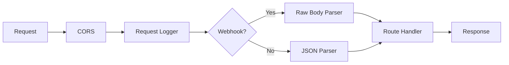
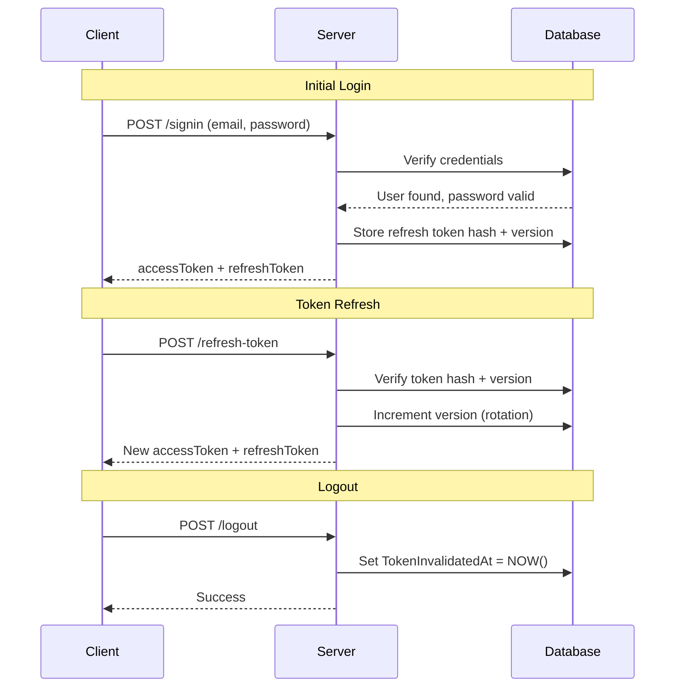
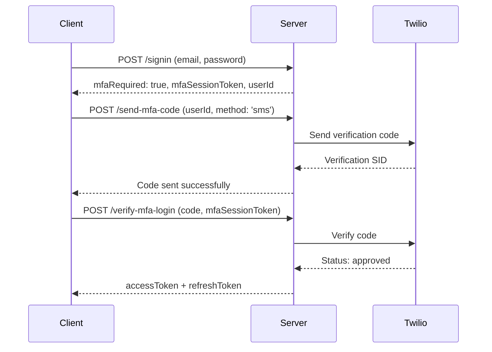

# Backend Developer Guide

A comprehensive technical reference for the ApogeeHnP backend, covering architecture, security, database design, and system internals.

> **For step-by-step API testing instructions**, see [API Testing Guide](API_TESTING_GUIDE.md).

---

## Table of Contents

1. [Architecture Overview](#1-architecture-overview)
2. [Database](#2-database)
3. [Authentication System](#3-authentication-system)
4. [Security Features](#4-security-features)
5. [Error Codes Reference](#5-error-codes-reference)
6. [Configuration Reference](#6-configuration-reference)
7. [External Services](#7-external-services)
8. [Middleware Reference](#8-middleware-reference)
9. [Utilities Reference](#9-utilities-reference)
10. [Routes Overview](#10-routes-overview)
11. [Environment Configuration](#11-environment-configuration)
12. [Development Setup](#12-development-setup)
13. [Testing](#13-testing)
14. [Deployment](#14-deployment)
15. [Quick Reference](#15-quick-reference)

---

## 1. Architecture Overview

### Project Structure

```
Server/
├── config/
│   └── db.js                    # Azure SQL connection configuration
├── middleware/
│   ├── authMiddleware.js        # JWT authentication & rate limiting
│   ├── mfaMiddleware.js         # Multi-factor authentication enforcement
│   ├── multerUpload.js          # File upload handling (profile images)
│   ├── blobClient.js            # Azure Blob Storage client
│   └── validators.js            # Request body validation schemas
├── routes/
│   ├── authRoutes.js            # Authentication endpoints (22 routes)
│   ├── userRoutes.js            # User profile management (3 routes)
│   ├── dataRoutes.js            # Data CRUD operations (40+ routes)
│   ├── chatbotRoutes.js         # AI assistant endpoints (3 routes)
│   ├── workoutRoutes.js         # AI workout plans (5 routes)
│   └── usageRoutes.js           # Usage tracking (3 routes)
├── utils/
│   ├── token.js                 # JWT generation/verification
│   ├── logger.js                # Structured logging
│   ├── twilioService.js         # SMS/Email OTP via Twilio
│   ├── mailer.js                # Email sending (password reset)
│   ├── cache.js                 # In-memory caching
│   ├── queryBuilder.js          # Safe SQL query construction
│   ├── pagination.js            # Paginated response helpers
│   ├── transactionRecorder.js   # Subscription event logging
│   └── paymentGatewayRouter.js  # Payment gateway routing
├── swagger/
│   └── schemas.js               # OpenAPI schema definitions
├── scripts/                     # Database migrations & utilities
├── tests/                       # Unit, integration, and E2E tests
├── server.js                    # Application entry point
├── swagger.js                   # Swagger/OpenAPI configuration
└── package.json                 # Dependencies and scripts
```

### Tech Stack

| Category         | Technology           | Version/Notes               |
| ---------------- | -------------------- | --------------------------- |
| Runtime          | Node.js              | 20.x LTS                    |
| Framework        | Express.js           | 4.x                         |
| Database         | Azure SQL            | via `mssql` package         |
| Authentication   | JWT                  | Access + Refresh token pair |
| Password Hashing | bcrypt               | 12 salt rounds              |
| OTP Service      | Twilio Verify        | SMS and Email channels      |
| Payments         | Stripe               | Subscriptions, webhooks     |
| File Storage     | Azure Blob Storage   | Profile images              |
| AI               | Google Generative AI | Gemini 2.5 Pro              |
| API Docs         | Swagger/OpenAPI      | 3.0 spec                    |
| Logging          | Custom logger        | Environment-aware           |

### Request Lifecycle



**Middleware execution order in `server.js`:**

1. **CORS** - Cross-origin resource sharing
2. **Request Logger** - Logs method and path to Azure
3. **Raw Body Parser** - For Stripe webhook signature verification (`/api/data/webhooks/stripe`)
4. **JSON Parser** - Parses JSON request bodies
5. **Route Handlers** - Business logic

### Entry Point Flow

```javascript
// server.js startup sequence
1. Load environment variables (dotenv)
2. Initialize Express app
3. Configure middleware stack
4. Mount Swagger documentation (/api/docs)
5. Mount API routes (/api/auth, /api/user, etc.)
6. Connect to database (await connectToDatabase())
7. Start HTTP server (app.listen)
```

---

## 2. Database

### Connection Configuration

The database connection is managed in `config/db.js` using the `mssql` package.

```javascript
const config = {
  user: process.env.DB_USER,
  password: process.env.DB_PASSWORD,
  server: process.env.DB_HOST,
  database: process.env.DB_NAME,
  connectionTimeout: 30000, // 30 seconds
  requestTimeout: 30000, // 30 seconds
  options: {
    encrypt: true, // Required for Azure SQL
    trustServerCertificate: false,
  },
};
```

**Key Functions:**

- `connectToDatabase()` - Establishes connection pool
- `getPool()` - Returns the active connection pool

### Schema Overview

#### User Tables

| Table         | Key Columns                                                                                                                                | Purpose                    |
| ------------- | ------------------------------------------------------------------------------------------------------------------------------------------ | -------------------------- |
| `UserProfile` | UserID (IDENTITY), FirstName, LastName, Age, Weight, Height, BodyFat, Muscle, Gender, FitnessLevel, FitnessGoal, UserType, ProfileImageUrl | User profile data (parent) |
| `UserLogin`   | UserID (FK→UserProfile), Email, Password, RefreshToken, RefreshTokenVersion, MFAEnabled, MFAMethod, TokenInvalidatedAt                     | Authentication credentials |

> **Note:** `UserProfile` is the parent table with `IDENTITY`. `UserLogin` references `UserProfile` via FK.

#### Authentication Tables

| Table              | Key Columns                                                                                                | Purpose                        |
| ------------------ | ---------------------------------------------------------------------------------------------------------- | ------------------------------ |
| `OTPVerifications` | VerificationID, UserID, PhoneOrEmail, VerificationSid, Purpose, Status, AttemptCount, CreatedAt, ExpiresAt | OTP tracking and rate limiting |
| `PasswordResets`   | ResetID, UserID, TokenHash, Used, CreatedAt, ExpiresAt                                                     | Password reset token tracking  |

#### Data Tables

| Table               | Key Columns                                                                          | Purpose              |
| ------------------- | ------------------------------------------------------------------------------------ | -------------------- |
| `DailyLogs`         | LogID, UserID, Sleep, Steps, Heartrate, WaterIntake, Weight, EffectiveDate           | Daily health metrics |
| `ExerciseExistence` | ExerciseExistenceID, UserID, ExerciseID, ExerciseName, Sets, Reps, Weight, RPE, Date | Exercise logging     |
| `WorkoutRoutine`    | WorkoutRoutineID, UserID, WorkoutName, ExerciseInstances, Duration, Completed        | Workout sessions     |

#### Training Program Tables

| Table         | Key Columns                                                             | Purpose                     |
| ------------- | ----------------------------------------------------------------------- | --------------------------- |
| `Mesocycles`  | id, UserID, start_date, end_date, is_current                            | Training blocks (4-8 weeks) |
| `Microcycles` | id, mesocycle_id, UserID, week_number, start_date, end_date, is_current | Weekly training cycles      |

#### AI & Chat Tables

| Table            | Key Columns                                                            | Purpose                    |
| ---------------- | ---------------------------------------------------------------------- | -------------------------- |
| `AIWorkoutPlans` | PlanID, UserID, ChatSessionID, PlanData, Goal, Split, Status, IsActive | AI-generated workout plans |
| `ChatbotSession` | chatSessionID, UserId, SessionType, LastActivity                       | Chat session management    |
| `ChatMessages`   | MessageID, ChatSessionID, UserID, Role, Content, Timestamp             | Chat history               |

#### Subscription Tables

| Table                       | Key Columns                                                             | Purpose                       |
| --------------------------- | ----------------------------------------------------------------------- | ----------------------------- |
| `plans`                     | plan_code (PK), display_name, amount, billing_interval, stripe_price_id | Subscription plan definitions |
| `user_subscriptions`        | UserId, plan (FK→plans), subscription_id, status, billing_interval      | Active subscriptions          |
| `subscription_transactions` | transaction_id, UserId, transaction_type, from_plan, to_plan, amount    | Subscription history          |

#### Usage Tables

| Table       | Key Columns                                                          | Purpose               |
| ----------- | -------------------------------------------------------------------- | --------------------- |
| `UserUsage` | UsageID, UserID, GeneralInquiryCount, WorkoutInquiryCount, WeekStart | Weekly usage tracking |

#### Rewards Tables

| Table                | Key Columns                                                                             | Purpose                       |
| -------------------- | --------------------------------------------------------------------------------------- | ----------------------------- |
| `RewardDefinitions`  | RewardID (PK), RewardKey, Category, Name, Description, XPValue, RequiredCount, IsActive | Available rewards catalog     |
| `UserRewards`        | UserRewardID (PK), UserID, TotalXP, CurrentTier, CurrentLevel, LevelUpAt, LastUpdated   | User's XP, level, and tier    |
| `UserRewardProgress` | ProgressID (PK), UserID, RewardID, CurrentProgress, IsCompleted, IsClaimed, CompletedAt | Track progress on each reward |
| `UserRewardHistory`  | HistoryID (PK), UserID, RewardID, XPEarned, Reason, EarnedAt                            | Log of all XP earned          |

**Level System Tables:**

| Table               | Key Columns                                                                                    | Purpose                   |
| ------------------- | ---------------------------------------------------------------------------------------------- | ------------------------- |
| `PersonalRecords`   | RecordID (PK), UserID, ExerciseID, ExerciseName, RecordType, RecordValue, PreviousValue, SetAt | Personal best tracking    |
| `DailySignIn`       | SignInID (PK), UserID, SignInDate, XPAwarded, SignInAt                                         | Daily sign-in XP tracking |
| `AchievementBadges` | BadgeID (PK), BadgeKey, Name, Description, Category, RequiredValue, Icon, XPReward             | Badge definitions catalog |
| `UserBadges`        | UserBadgeID (PK), UserID, BadgeID, CurrentProgress, IsEarned, EarnedAt, PeriodStart            | User badge progress       |
| `UserStreaks`       | StreakID (PK), UserID, StreakType, CurrentStreak, LongestStreak, LastActivityDate              | Streak tracking           |
| `DailyXPAwards`     | AwardID (PK), UserID, AwardType, AwardDate, XPAwarded, AwardedAt                               | Prevent double XP awards  |

**Reward Categories:** `daily`, `weekly`, `monthly`, `streak`, `special` (Note: `universal` category deprecated - items moved to `daily` or badges)

**Level System (1-21+):**

| Levels | Tier      | Name         | Min XP | XP Gap per Level |
| ------ | --------- | ------------ | ------ | ---------------- |
| 1-5    | BRONZE    | Beginner     | 0      | 100 XP           |
| 6-10   | SILVER    | Intermediate | 500    | 200 XP           |
| 11-15  | GOLD      | Advanced     | 1500   | 300 XP           |
| 16-20  | EXCLUSIVE | Elite        | 3000   | 400 XP           |
| 21+    | CHAMPION  | Champion     | 5000   | -                |

**XP Events:**

| Event            | XP   | Trigger                    |
| ---------------- | ---- | -------------------------- |
| Daily sign-in    | 10   | First API call of day      |
| Workout complete | 50   | All routine exercises done |
| Custom routine   | 75   | Custom workout completed   |
| Water logged     | 5    | Water intake recorded      |
| Sleep logged     | 5    | Sleep data recorded        |
| Step goal (10k)  | 20   | Daily steps >= 10,000      |
| AI form review   | 25   | Form analysis completed    |
| Personal record  | 50   | New PR detected            |
| Daily combo      | 5    | Workout + water + sleep    |
| Streak bonus     | +10% | Applied after 7-day streak |

**XP Award Tracking (`services/xpEventService.js`):**

All XP events are recorded in `DailyXPAwards` table to prevent duplicate awards and enable daily status tracking:
- `wasAwardedToday(userId, awardType)` - Checks if user already received award today
- `recordDailyAward(userId, awardType, xpAmount)` - Records award with unique constraint on (UserID, AwardType, AwardDate). Returns `true` if insert succeeded, `false` if unique constraint was violated.

**Race Condition Prevention:** The unique constraint `UQ_DailyXP_UserTypeDate` is the authoritative check for concurrent requests. When two requests race:
1. Both pass `wasAwardedToday()` check (no record exists yet)
2. First `recordDailyAward()` INSERT succeeds, returns `true` → proceeds to award XP
3. Second `recordDailyAward()` INSERT fails (unique constraint), returns `false` → returns early without awarding XP

This ensures only the first concurrent request awards XP, preventing duplicate XP exploits.

The `GET /rewards/user` endpoint maps these AwardTypes to rewardKeys for the frontend:
| AwardType        | RewardKey        |
| ---------------- | ---------------- |
| `water_log`      | `log_water`      |
| `sleep_log`      | `log_sleep`      |
| `step_goal`      | `step_goal`      |
| `form_review`    | `form_ai_review` |
| `daily_combo`    | `daily_combo`    |
| `workout_complete` | `complete_workout` |
| `custom_routine` | `complete_workout` |

**Achievement Badges:**

| Badge Key          | Name             | Requirement                      | XP Reward |
| ------------------ | ---------------- | -------------------------------- | --------- |
| `consistency_king` | Consistency King | 30-day workout streak            | 200       |
| `hydration_hero`   | Hydration Hero   | 7 consecutive water logging days | 75        |
| `sleep_master`     | Sleep Master     | 20% sleep score improvement      | 100       |
| `step_slayer`      | Step Slayer      | 100,000 steps in one week        | 150       |
| `record_breaker`   | Record Breaker   | 5 personal records in one month  | 125       |

### Connection Pooling Pattern

```javascript
// Always use getPool() for database operations
const pool = getPool();

// Parameterized queries prevent SQL injection
const result = await pool
  .request()
  .input("userId", userId)
  .input("email", email.toLowerCase()).query(`
    SELECT * FROM dbo.UserLogin 
    WHERE UserID = @userId AND Email = @email
  `);
```

---

## 3. Authentication System

### Token Architecture

ApogeeHnP uses a **dual-token system** for secure authentication:

| Token Type    | Expiry     | Purpose                     | Storage Location      |
| ------------- | ---------- | --------------------------- | --------------------- |
| Access Token  | 15 minutes | API authorization           | Memory/secure storage |
| Refresh Token | 7 days     | Obtaining new access tokens | Secure storage only   |

### Token Lifecycle



### JWT Structure

**Access Token Payload:**

```javascript
{
  userId: 123,
  email: "user@example.com",
  type: "access",
  iat: 1704153600,
  exp: 1704154500  // 15 minutes later
}
```

**Refresh Token Payload:**

```javascript
{
  userId: 123,
  tokenVersion: 5,
  type: "refresh",
  iat: 1704153600,
  exp: 1704758400  // 7 days later
}
```

### Token Generation (`utils/token.js`)

```javascript
// Generate token pair for login/refresh
const generateTokenPair = (payload) => ({
  accessToken: generateAccessToken(payload),
  refreshToken: generateRefreshToken(payload),
});

// Access token: short-lived, for API calls
const generateAccessToken = (payload) =>
  jwt.sign({ ...payload, type: "access" }, JWT_SECRET, { expiresIn: "15m" });

// Refresh token: long-lived, for obtaining new access tokens
const generateRefreshToken = (payload) =>
  jwt.sign({ ...payload, type: "refresh" }, JWT_SECRET, { expiresIn: "7d" });
```

### Token Rotation with Optimistic Locking

To prevent race conditions during token refresh, the system uses **optimistic locking** with a token version number:

```sql
-- Atomic refresh with version check
UPDATE UserLogin
SET RefreshTokenHash = @newHash,
    RefreshTokenVersion = RefreshTokenVersion + 1
WHERE UserID = @userId
  AND RefreshTokenVersion = @currentVersion

-- If rowsAffected = 0, another request already rotated the token
-- Return TOKEN_ALREADY_ROTATED error
```

### Session Invalidation

Sessions are invalidated in these scenarios:

1. **Logout** - Sets `TokenInvalidatedAt` to current timestamp
2. **Login from another device** - Updates `TokenInvalidatedAt`, invalidating previous sessions
3. **Password change** - Forces re-authentication

**Validation check in `authenticateToken` middleware:**

```javascript
// Check if token was issued before invalidation
if (user.TokenInvalidatedAt && tokenIssuedAt < user.TokenInvalidatedAt) {
  return res.status(401).json({
    errorCode: "SESSION_INVALIDATED",
    message: "Session expired. Please login again.",
  });
}
```

### Password Security

- **Hashing**: bcrypt with 12 salt rounds
- **Minimum requirements**: 8 characters (enforced client-side)
- **Reset flow**: 6-digit OTP via email, 10-minute expiry

---

## 4. Security Features

### Rate Limiting

#### Authentication Rate Limiting

Prevents brute-force attacks on login endpoints.

| Parameter    | Value      | Description                       |
| ------------ | ---------- | --------------------------------- |
| Window       | 15 minutes | Time window for counting attempts |
| Max Attempts | 5          | Failed attempts before lockout    |
| Scope        | IP address | Rate limit key                    |

**Implementation (`middleware/authMiddleware.js`):**

```javascript
const authRateLimits = new Map(); // IP -> { attempts, windowStart }

const checkAuthRateLimit = (req, res, next) => {
  const ip = req.ip;
  const entry = authRateLimits.get(ip);

  if (entry && entry.attempts >= 5) {
    const remainingTime = 15 * 60 * 1000 - (Date.now() - entry.windowStart);
    return res.status(429).json({
      errorCode: "RATE_LIMIT_EXCEEDED",
      message: "Too many attempts. Try again later.",
      retryAfter: Math.ceil(remainingTime / 1000),
    });
  }
  next();
};
```

#### OTP Rate Limiting

Prevents OTP abuse.

| Parameter | Value            | Description               |
| --------- | ---------------- | ------------------------- |
| Limit     | 15 requests/hour | Per phone number or email |
| Cooldown  | 60 seconds       | Between consecutive OTPs  |

### MFA (Multi-Factor Authentication)



**MFA-Protected Operations:**

```javascript
const MFA_REQUIRED_OPERATIONS = [
  "update_email",
  "update_password",
  "update_phone",
  "delete_account",
  "disable_mfa",
  "payment_update",
  "subscription_change",
];
```

### Race Condition Prevention

#### Concurrent Token Refresh

**Problem:** Multiple clients refreshing the same token simultaneously could lead to one client being locked out.

**Solution:** Optimistic locking with version numbers:

```javascript
// Only one refresh succeeds; others get TOKEN_ALREADY_ROTATED
const result = await pool
  .request()
  .input("userId", userId)
  .input("currentVersion", tokenPayload.tokenVersion).query(`
    UPDATE UserLogin
    SET RefreshTokenVersion = RefreshTokenVersion + 1
    WHERE UserID = @userId AND RefreshTokenVersion = @currentVersion
  `);

if (result.rowsAffected[0] === 0) {
  return res.status(401).json({ errorCode: "TOKEN_ALREADY_ROTATED" });
}
```

#### Concurrent OTP Verification

**Problem:** Same OTP code verified multiple times in parallel.

**Solution:** Atomic status update with check:

```javascript
// Mark as used atomically - only first request succeeds
const updateResult = await pool.request().input("phoneOrEmail", phoneOrEmail)
  .query(`
    UPDATE OTPVerifications
    SET Status = 'approved'
    WHERE PhoneOrEmail = @phoneOrEmail 
      AND Status = 'pending'
      AND ExpiresAt > GETDATE()
  `);

if (updateResult.rowsAffected[0] === 0) {
  return res.status(400).json({ errorCode: "CODE_ALREADY_USED" });
}
```

### Input Validation

#### SQL Injection Prevention

All queries use parameterized inputs:

```javascript
// SAFE - parameterized query
await pool
  .request()
  .input("email", email)
  .query("SELECT * FROM UserLogin WHERE Email = @email");

// UNSAFE - string concatenation (NEVER do this)
// await pool.query(`SELECT * FROM UserLogin WHERE Email = '${email}'`);
```

#### Field Whitelisting (`utils/queryBuilder.js`)

Dynamic UPDATE queries only allow whitelisted fields:

```javascript
const ALLOWED_FIELDS = {
  DailyLogs: ['Sleep', 'Steps', 'Heartrate', 'WaterIntake', ...],
  ExerciseExistence: ['ExerciseName', 'Sets', 'Reps', 'Weight', ...],
  // ...
};

// Only whitelisted fields are included in UPDATE
const { safeFields, rejectedFields } = filterFields('DailyLogs', req.body);
```

---

## 5. Error Codes Reference

### Authentication Errors

| Error Code              | HTTP Status | When It Occurs                                           | Frontend Action                   |
| ----------------------- | ----------- | -------------------------------------------------------- | --------------------------------- |
| `MISSING_TOKEN`         | 401         | No Authorization header provided                         | Redirect to login                 |
| `TOKEN_EXPIRED`         | 401         | Access token has expired                                 | Call `/refresh-token`             |
| `TOKEN_INVALID`         | 403         | Token is malformed or tampered                           | Clear tokens, redirect to login   |
| `REFRESH_REQUIRED`      | 401         | Access token expiring soon                               | Call `/refresh-token` proactively |
| `TOKEN_TYPE_MISMATCH`   | 401         | Wrong token type used (e.g., refresh token for API call) | Use correct token type            |
| `TOKEN_ALREADY_ROTATED` | 401         | Refresh token was already used (concurrent request)      | Clear tokens, redirect to login   |
| `SESSION_INVALIDATED`   | 401         | Token was issued before logout/login elsewhere           | Clear tokens, redirect to login   |
| `LOGGED_IN_ELSEWHERE`   | 401         | Another device logged into this account                  | Show message, redirect to login   |

### MFA Errors

| Error Code                 | HTTP Status | When It Occurs                        | Frontend Action     |
| -------------------------- | ----------- | ------------------------------------- | ------------------- |
| `MFA_REQUIRED`             | 403         | Operation requires MFA verification   | Prompt for MFA code |
| `MFA_SESSION_EXPIRED`      | 401         | MFA session exceeded 10-minute window | Restart signin flow |
| `MFA_SESSION_ALREADY_USED` | 401         | MFA session token already consumed    | Restart signin flow |
| `MFA_SESSION_INVALID`      | 401         | Invalid MFA session token             | Restart signin flow |

### OTP Errors

| Error Code           | HTTP Status | When It Occurs                             | Frontend Action         |
| -------------------- | ----------- | ------------------------------------------ | ----------------------- |
| `OTP_INVALID`        | 400         | Wrong verification code entered            | Show error, allow retry |
| `OTP_EXPIRED`        | 400         | Code exceeded validity period              | Request new code        |
| `CODE_ALREADY_USED`  | 400         | Code was already verified (race condition) | Request new code        |
| `TOKEN_ALREADY_USED` | 400         | Password reset token was already used      | Request new reset       |

### Rate Limiting Errors

| Error Code                | HTTP Status | When It Occurs                 | Frontend Action     |
| ------------------------- | ----------- | ------------------------------ | ------------------- |
| `RATE_LIMIT_EXCEEDED`     | 429         | Too many auth attempts from IP | Show cooldown timer |
| `OTP_RATE_LIMIT_EXCEEDED` | 429         | Too many OTP requests          | Show cooldown timer |
| `USAGE_LIMIT_EXCEEDED`    | 429         | Weekly AI query limit reached  | Show upgrade prompt |

### Subscription Errors

| Error Code               | HTTP Status | When It Occurs                        | Frontend Action           |
| ------------------------ | ----------- | ------------------------------------- | ------------------------- |
| `SUBSCRIPTION_REQUIRED`  | 403         | Premium feature accessed by free user | Show subscription CTA     |
| `SUBSCRIPTION_NOT_FOUND` | 404         | No active subscription for user       | Show subscription options |
| `PAYMENT_FAILED`         | 400         | Payment processing failed             | Show payment error, retry |

### General Errors

| Error Code         | HTTP Status | When It Occurs                   | Frontend Action           |
| ------------------ | ----------- | -------------------------------- | ------------------------- |
| `AUTH_REQUIRED`    | 401         | Endpoint requires authentication | Redirect to login         |
| `VALIDATION_ERROR` | 400         | Request body validation failed   | Show field errors         |
| `NOT_FOUND`        | 404         | Requested resource doesn't exist | Show 404 page             |
| `SERVER_ERROR`     | 500         | Internal server error            | Show generic error, retry |

---

## 6. Configuration Reference

### Timing Configuration

| Config                    | Value      | Location                 | Description                |
| ------------------------- | ---------- | ------------------------ | -------------------------- |
| Access Token Expiry       | 15 minutes | `utils/token.js`         | Short-lived API access     |
| Refresh Token Expiry      | 7 days     | `utils/token.js`         | Long-lived session token   |
| MFA Session Expiry        | 10 minutes | `routes/authRoutes.js`   | Window to complete MFA     |
| OTP Expiry                | 10 minutes | `utils/twilioService.js` | Verification code validity |
| Password Reset Expiry     | 10 minutes | `routes/authRoutes.js`   | Reset token validity       |
| Phone Verification Window | 30 minutes | `routes/authRoutes.js`   | Signup OTP validity        |

### Rate Limiting Configuration

| Config                 | Value      | Location                       | Description                  |
| ---------------------- | ---------- | ------------------------------ | ---------------------------- |
| Auth Rate Limit Window | 15 minutes | `middleware/authMiddleware.js` | Failed login tracking period |
| Auth Rate Limit Max    | 5 attempts | `middleware/authMiddleware.js` | Attempts before lockout      |
| OTP Rate Limit         | 15/hour    | `utils/twilioService.js`       | Per phone/email              |
| OTP Cooldown           | 60 seconds | `utils/twilioService.js`       | Between consecutive OTPs     |

### Database Configuration

| Config             | Value      | Location       | Description                |
| ------------------ | ---------- | -------------- | -------------------------- |
| Connection Timeout | 30 seconds | `config/db.js` | Initial connection timeout |
| Request Timeout    | 30 seconds | `config/db.js` | Query execution timeout    |
| Encryption         | TLS        | `config/db.js` | Azure SQL encryption       |

### Usage Limits

**Chatbot/Workout AI:**

| User Type | General Inquiries | Workout Plans | Notes               |
| --------- | ----------------- | ------------- | ------------------- |
| Free      | 5/week            | 3/week        | Resets every Monday |
| Premium   | 100/week          | 100/week      | Shared pool         |

**Challenge Suggestions (All Users):**

| Limit Type | Value | Rolling Window | Notes |
| ---------- | ----- | -------------- | ----- |
| Hourly     | 10    | Last 60 min    | Smooth UX for exploration |
| Daily      | 20    | Last 24 hours  | Prevents API abuse |

Tracked in `ChallengeSuggestionUsage` table with timestamps. Response includes `rateLimit` object with remaining counts.

### Pagination Defaults

| Config            | Value | Description           |
| ----------------- | ----- | --------------------- |
| Default Page Size | 20    | Items per page        |
| Max Page Size     | 100   | Maximum allowed limit |
| Default Page      | 1     | Starting page number  |

---

## 7. External Services

### Twilio Verify

Used for SMS and email OTP verification.

**Configuration:**

```javascript
const accountSid = process.env.TWILIO_ACCOUNT_SID;
const authToken = process.env.TWILIO_AUTH_TOKEN;
const verifyServiceSid = process.env.TWILIO_VERIFY_SERVICE_SID;
```

**Supported Channels:**

- `sms` - Phone verification
- `email` - Email verification (via SendGrid integration in Twilio)

**Key Functions (`utils/twilioService.js`):**
| Function | Description |
|----------|-------------|
| `sendPhoneOTP(phoneNumber)` | Send SMS verification code |
| `verifyPhoneOTP(phoneNumber, code)` | Verify SMS code |
| `sendEmailOTP(email)` | Send email verification code |
| `verifyEmailOTP(email, code)` | Verify email code |
| `checkRateLimit(pool, userId, destination, purpose)` | Check OTP rate limits |

#### Email OTP Purposes

The backend supports **5 email OTP purposes**:

| Purpose          | Use Case                                             | Response on Verification |
| ---------------- | ---------------------------------------------------- | ------------------------ |
| `signup`         | Email verification during account creation           | `{ verified: true }`     |
| `verification`   | Alternative name for signup (frontend compatibility) | `{ verified: true }`     |
| `signin`         | Passwordless login via email OTP                     | Full auth tokens         |
| `mfa`            | Multi-factor authentication via email                | Full auth tokens         |
| `password_reset` | Password recovery flow                               | `{ resetToken: "..." }`  |

**Security:** Rate limited to 15 OTP requests per hour per email. OTP codes expire after 10 minutes.

**Passwordless Signin Flow:**

```javascript
// 1. Send OTP for signin
await fetch("/api/auth/send-email-otp", {
  method: "POST",
  body: JSON.stringify({ email: "user@example.com", purpose: "signin" }),
});

// 2. Verify and get tokens directly
const { accessToken, refreshToken, user } = await fetch(
  "/api/auth/verify-email-otp",
  {
    method: "POST",
    body: JSON.stringify({
      email: "user@example.com",
      code: "123456",
      purpose: "signin",
    }),
  }
).then((r) => r.json());
```

**Testing Twilio/Email Setup:**

```bash
node scripts/test-email-otp.js
```

### Stripe

Used for subscription management and payments.

**Configuration:**

```javascript
const stripe = require("stripe")(process.env.STRIPE_SECRET_KEY);
```

**Key Operations:**

- Create checkout sessions
- Manage subscriptions (upgrade, downgrade, cancel)
- Process webhooks for async events

**Webhook Events Handled:**

- `checkout.session.completed`
- `customer.subscription.updated`
- `customer.subscription.deleted`
- `invoice.payment_succeeded`
- `invoice.payment_failed`

### Azure Blob Storage

Used for storing user profile images.

**Configuration (`middleware/blobClient.js`):**

```javascript
const { BlobServiceClient } = require("@azure/storage-blob");
const connectionString = process.env.AZURE_STORAGE_CONNECTION_STRING;
const containerName = "profile-images";
```

**Upload Flow:**

1. Multer receives file upload
2. File is uploaded to Azure Blob Storage
3. Blob URL is stored in `UserProfile.ProfileImageUrl`

### Google Generative AI (Gemini)

Used for AI chatbot and workout plan generation.

**Configuration:**

```javascript
const { GoogleGenerativeAI } = require("@google/generative-ai");
const GOOGLE_API_KEY = process.env.GEMINI_API_KEY;
const MODEL_NAME = process.env.GEMINI_MODEL_NAME || "gemini-2.5-pro";
```

**Response Schema:**
The AI returns structured JSON responses with:

- `mode`: GENERAL, WORKOUT_CONFIRM, WORKOUT_CREATE, WORKOUT_MODIFY, OUT_OF_SCOPE
- `intent`: GENERAL, WORKOUT_REQUEST, WORKOUT_MODIFICATION, OUT_OF_SCOPE
- `message`: { title, body }
- `payload`: Context-specific data (workout plans, summaries)
- `errors`: Any errors encountered

---

## 8. Middleware Reference

### Authentication Middleware (`middleware/authMiddleware.js`)

| Middleware                 | Purpose                                             | Usage                               |
| -------------------------- | --------------------------------------------------- | ----------------------------------- |
| `authenticateToken`        | Validates JWT access token, checks session validity | Protected routes                    |
| `authenticateRefreshToken` | Validates refresh token for token rotation          | `/refresh-token`                    |
| `optionalAuth`             | Non-blocking auth check, attaches user if valid     | Public routes with optional auth    |
| `checkAuthRateLimit`       | IP-based rate limiting for auth endpoints           | `/signin`, `/signup`, OTP endpoints |
| `resetAuthRateLimit`       | Clears rate limit on successful auth                | After successful login              |

**Example Usage:**

```javascript
// Protected route
router.get("/profile", authenticateToken, async (req, res) => {
  const userId = req.user.userId; // Set by authenticateToken
  // ...
});

// Rate-limited auth endpoint
router.post("/signin", checkAuthRateLimit, async (req, res) => {
  // ...
});
```

### MFA Middleware (`middleware/mfaMiddleware.js`)

| Middleware              | Purpose                               | Usage                         |
| ----------------------- | ------------------------------------- | ----------------------------- |
| `requireMFA(operation)` | Enforces MFA for sensitive operations | Account deletion, MFA disable |
| `suggestMFA(operation)` | Non-blocking MFA suggestion           | Analytics, logging            |

**Example Usage:**

```javascript
// MFA-protected route
router.delete(
  "/profile",
  authenticateToken,
  requireMFA("delete_account"),
  async (req, res) => {
    // Only reached if MFA verified (or user has MFA disabled)
  }
);
```

**Functions:**
| Function | Description |
|----------|-------------|
| `getUserMFAStatus(userId)` | Returns `{ mfaEnabled, mfaMethod }` |
| `validateMFASession(token, userId, operation)` | Validates MFA session token |
| `recordMFAVerification(pool, userId, method)` | Records successful MFA |

### File Upload Middleware (`middleware/multerUpload.js`)

Handles multipart form data for profile image uploads.

```javascript
const upload = require("../middleware/multerUpload");

router.post("/signup", upload.single("profileImage"), async (req, res) => {
  // req.file contains the uploaded file
  // Upload to Azure Blob Storage
});
```

### Validators (`middleware/validators.js`)

Express-validator schemas for request validation.

| Validator                           | Purpose                        |
| ----------------------------------- | ------------------------------ |
| `dailyLogUpdateValidation`          | Validates daily log PATCH body |
| `exerciseExistenceUpdateValidation` | Validates exercise update body |
| `workoutRoutineUpdateValidation`    | Validates workout routine body |
| `mesocycleUpdateValidation`         | Validates mesocycle body       |
| `microcycleUpdateValidation`        | Validates microcycle body      |
| `idParamValidation`                 | Validates numeric ID params    |
| `logIdParamValidation`              | Validates log ID params        |

---

## 9. Utilities Reference

### Logger (`utils/logger.js`)

Environment-aware structured logging.

| Method                                            | Visibility | Description                  |
| ------------------------------------------------- | ---------- | ---------------------------- |
| `logger.debug(message, context)`                  | Dev only   | Detailed debugging info      |
| `logger.info(message, context)`                   | Always     | General information          |
| `logger.warn(message, context)`                   | Always     | Warning conditions           |
| `logger.error(message, context)`                  | Always     | Error conditions (sanitized) |
| `logger.request(method, path)`                    | Always     | HTTP request logging         |
| `logger.response(method, path, status, duration)` | Always     | HTTP response logging        |
| `logger.db(operation, table, context)`            | Always     | Database operation logging   |

**Example:**

```javascript
logger.info("User signup", { userId: 123, email: "user@example.com" });
logger.error("Database error", { error: err.message, table: "UserLogin" });
```

### Token Utilities (`utils/token.js`)

| Function                                | Description                            |
| --------------------------------------- | -------------------------------------- |
| `generateAccessToken(payload)`          | Creates 15-minute access token         |
| `generateRefreshToken(payload)`         | Creates 7-day refresh token            |
| `generateTokenPair(payload)`            | Returns both tokens                    |
| `verifyToken(token, type)`              | Verifies and decodes token             |
| `decodeToken(token)`                    | Decodes without verification           |
| `isTokenExpiring(token, bufferSeconds)` | Checks if token expires within buffer  |
| `getRefreshTokenExpiry()`               | Returns expiry time for refresh tokens |

### Twilio Service (`utils/twilioService.js`)

| Function                                                     | Description             |
| ------------------------------------------------------------ | ----------------------- |
| `sendPhoneOTP(phoneNumber)`                                  | Send SMS verification   |
| `verifyPhoneOTP(phoneNumber, code)`                          | Verify SMS code         |
| `sendEmailOTP(email)`                                        | Send email verification |
| `verifyEmailOTP(email, code)`                                | Verify email code       |
| `isValidE164(phoneNumber)`                                   | Validate E.164 format   |
| `checkRateLimit(pool, userId, phoneOrEmail, purpose)`        | Check OTP rate limits   |
| `recordOTPAttempt(pool, userId, phoneOrEmail, sid, purpose)` | Record OTP attempt      |
| `updateOTPStatus(pool, phoneOrEmail, purpose, status)`       | Update OTP status       |

### Mailer (`utils/mailer.js`)

| Function                              | Description                    |
| ------------------------------------- | ------------------------------ |
| `sendPasswordResetEmail(email, code)` | Sends password reset OTP email |

### Cache (`utils/cache.js`)

Simple in-memory cache with TTL support.

```javascript
const { SimpleCache } = require("../utils/cache");

const cache = new SimpleCache(24 * 60 * 60 * 1000, 100); // 24h TTL, max 100 entries
cache.set("key", data);
const value = cache.get("key"); // null if expired
cache.invalidate("key");
cache.clear();
```

### Query Builder (`utils/queryBuilder.js`)

Safe dynamic query construction with field whitelisting.

| Function                                       | Description                                    |
| ---------------------------------------------- | ---------------------------------------------- |
| `filterFields(tableName, fields)`              | Filters fields against whitelist               |
| `buildUpdateQuery(tableName, fields, request)` | Builds parameterized UPDATE query              |
| `validateFieldsStrict(tableName, fields)`      | Strict validation (fails if any field invalid) |

### Pagination (`utils/pagination.js`)

| Function                                      | Description                                   |
| --------------------------------------------- | --------------------------------------------- |
| `paginate(req)`                               | Extracts `{ page, limit, offset }` from query |
| `paginatedResponse(data, page, limit, total)` | Builds paginated response object              |

**Response Format:**

```json
{
  "data": [...],
  "pagination": {
    "page": 1,
    "limit": 20,
    "total": 150,
    "totalPages": 8,
    "hasMore": true
  }
}
```

### Transaction Recorder (`utils/transactionRecorder.js`)

Records subscription lifecycle events.

| Function                                | Description                      |
| --------------------------------------- | -------------------------------- |
| `recordTransaction(data)`               | Records subscription transaction |
| `getTransactionHistory(userId, months)` | Gets transaction history         |

**Transaction Types:** `activation`, `upgrade`, `downgrade`, `pause`, `resume`, `cancellation`, `expiration`, `renewal`

### Payment Gateway Router (`utils/paymentGatewayRouter.js`)

Routes to correct payment gateway based on user's subscription.

| Function                      | Description                     |
| ----------------------------- | ------------------------------- |
| `getPaymentGateway(userId)`   | Returns gateway info for user   |
| `isGatewaySupported(gateway)` | Checks if gateway is supported  |
| `getGatewayConfig(gateway)`   | Returns gateway-specific config |

**Supported Gateways:** `stripe`, `apple_pay` (Google Pay coming soon)

---

## 10. Routes Overview

### Route Files Summary

| Route File         | Base Path      | Endpoints | Description                                    |
| ------------------ | -------------- | --------- | ---------------------------------------------- |
| `authRoutes.js`    | `/api/auth`    | 22        | Authentication, OTP, MFA, password reset       |
| `userRoutes.js`    | `/api/user`    | 3         | User profile CRUD                              |
| `dataRoutes.js`    | `/api/data`    | 40+       | Daily logs, exercises, routines, subscriptions |
| `chatbotRoutes.js` | `/api/chatbot` | 3         | AI assistant                                   |
| `configRoutes.js`  | `/api/config`  | 1         | Mobile app runtime configuration               |
| `workoutRoutes.js` | `/api/workout` | 5         | AI workout plans                               |
| `usageRoutes.js`   | `/api/usage`   | 3         | Usage tracking                                 |
| `rewardsRoutes.js` | `/api/rewards` | 20+       | XP rewards, challenges, AI suggestions         |

### Auth Routes (`/api/auth`)

| Method | Endpoint                   | Auth       | Description                    |
| ------ | -------------------------- | ---------- | ------------------------------ |
| POST   | `/signup`                  | -          | Create new account             |
| POST   | `/signin`                  | -          | Email/password login           |
| POST   | `/refresh-token`           | Refresh    | Get new token pair             |
| POST   | `/logout`                  | Access     | Invalidate session             |
| GET    | `/status`                  | Access     | Get auth status                |
| GET    | `/checkemail`              | -          | Check if email exists          |
| GET    | `/checkphone`              | -          | Check if phone exists          |
| POST   | `/send-phone-otp`          | -          | Send SMS OTP                   |
| POST   | `/verify-phone-otp`        | -          | Verify SMS OTP                 |
| POST   | `/verify-phone-number`     | Access     | Verify phone for existing user |
| POST   | `/send-email-otp`          | -          | Send email OTP                 |
| POST   | `/verify-email-otp`        | -          | Verify email OTP               |
| POST   | `/send-mfa-code`           | -          | Send MFA code                  |
| POST   | `/verify-mfa-login`        | -          | Complete MFA login             |
| POST   | `/verify-mfa-code`         | -          | Verify MFA for operations      |
| POST   | `/setup-mfa`               | Access     | Enable MFA                     |
| POST   | `/enable-mfa-direct`       | Access     | Enable MFA directly            |
| POST   | `/disable-mfa`             | Access+MFA | Disable MFA                    |
| PATCH  | `/update-login-preference` | Access     | Update login method            |
| POST   | `/forgot-password`         | -          | Request password reset         |
| POST   | `/reset-password`          | -          | Reset password with code       |
| PATCH  | `/update-profile/:userId`  | Access     | Update profile with image      |

### User Routes (`/api/user`)

| Method | Endpoint   | Auth       | Description         |
| ------ | ---------- | ---------- | ------------------- |
| GET    | `/profile` | Access     | Get user profile    |
| PATCH  | `/profile` | Access     | Update user profile |
| DELETE | `/profile` | Access+MFA | Delete account      |
| POST   | `/inquiry` | Access     | Send support inquiry email |

**Inquiry (POST `/inquiry`)**

**Body Fields:** `message` (required), `attachments` (optional).

**Attachments:**
- `multipart/form-data` field `attachments` (images/videos).
- JSON `attachments` array with `{ filename, contentBase64, contentType }`.

**Limits:** Max 5 attachments, 10MB each. Only `image/*` or `video/*` types are accepted.

**Notes:** Sends an email to `fitness@hpapogee.com` with subject "FitNxt Customer Inquiry". The sender email is taken from the authenticated user's account and used as the reply-to address.

### Data Routes (`/api/data`)

**Daily Logs:**
| Method | Endpoint | Description |
|--------|----------|-------------|
| GET | `/dailylogs` | Get all daily logs (paginated) |
| GET | `/dailylog/:logId` | Get specific log |
| POST | `/dailylog` | Create daily log |
| PATCH | `/dailylog/:logId` | Update daily log |
| DELETE | `/dailylog/:logId` | Delete daily log |

**Pre Assessment:**
| Method | Endpoint | Description |
|--------|----------|-------------|
| POST | `/preworkoutassessment` | Save pre-workout assessment |

**Body Fields:** `WorkoutPlanID`, `Feeling`, `WaterIntake`, `SleepQuality`, `SleepHours`, `RecoveryStatus`, `CreatedAt` (optional; defaults to now).

**Post Assessment:**
| Method | Endpoint | Description |
|--------|----------|-------------|
| POST | `/postassessment` | Save post-workout assessment |

**Body Fields:** `FeelingAfterWorkout`, `Assessperformance`, `NextSessionPlans`, `LastUpdateDate` (optional; defaults to now).

**Dashboard:**
| Method | Endpoint | Description |
|--------|----------|-------------|
| GET | `/dashboard/weekly-summary` | Get 7-day workout completion summary |

**Exercises:**
| Method | Endpoint | Description |
|--------|----------|-------------|
| GET | `/exercises` | Get exercise database from ExerciseDB API |
| POST | `/exercises` | Create custom exercise in dbo.Exercise |
| GET | `/exerciseexistences` | Get user's logged exercises (paginated) |
| GET | `/exerciseexistence/user/:exerciseId` | Get logged exercises by exercise ID |
| GET | `/exerciseexistence/date/:date` | Get logged exercises by date |
| POST | `/exerciseexistence` | Log new exercise(s) |
| PATCH | `/exerciseexistence/:id` | Update logged exercise |
| DELETE | `/exerciseexistence/:id` | Delete logged exercise |

**Notes:** When logging exercise instances, the server reuses an existing `ExerciseId` if the normalized `ExerciseName` matches an existing record to avoid duplicates.

**Custom Exercise (POST `/exercises`)**

**Body Fields:** `ExerciseName` (required), `ExerciseId` (optional), `TargetMuscle`, `Equipment`, `Instructions`, `ImageURL`.

**Notes:**
- If `ExerciseId` is omitted, the server generates a `custom_<userId>_<timestamp>_<uuid>` ID.
- Requests are idempotent by `ExerciseId` (existing record returns `200`).
- Requests are also de-duplicated by normalized `ExerciseName` (lowercased, punctuation/parentheticals removed).
- Exercise fields are bound as `NVARCHAR(MAX)` to avoid truncation for long values.

**Exercise History:**
| Method | Endpoint | Description |
|--------|----------|-------------|
| GET | `/exercises/unfinished` | Get unfinished exercises (Jump Back In) |
| GET | `/exercises/previous-all` | Get previous workout data for comparison |
| GET | `/exercises/history` | Get completed exercise history |

**Workout Routines:**
| Method | Endpoint | Description |
|--------|----------|-------------|
| GET | `/workoutroutines` | Get all routines (paginated) |
| GET | `/workoutroutine/:id` | Get specific routine |
| GET | `/workoutroutines/date/:date` | Get routines by date |
| GET | `/workoutroutine/exerciseinstances/:id` | Get exercises in a routine |
| POST | `/workoutroutine` | Create routine |
| PATCH | `/workoutroutine/:id` | Update routine |
| DELETE | `/workoutroutine/:id` | Delete routine |

**Mesocycles:**
| Method | Endpoint | Description |
|--------|----------|-------------|
| GET | `/mesocycles` | Get all mesocycles (paginated) |
| GET | `/mesocycles/date` | Get mesocycles by date range (query: start_date, end_date) |
| POST | `/mesocycle` | Create mesocycle |
| PATCH | `/mesocycle/:id` | Update mesocycle |
| DELETE | `/mesocycle/:id` | Delete mesocycle |

**Microcycles:**
| Method | Endpoint | Description |
|--------|----------|-------------|
| GET | `/microcycles` | Get all microcycles (paginated) |
| GET | `/microcycles/:mesocycle_id` | Get microcycles for a mesocycle |
| POST | `/microcycle` | Create microcycle |
| PATCH | `/microcycle/:id` | Update microcycle |
| DELETE | `/microcycle/:id` | Delete microcycle |

**Combined Training Cycles:**
| Method | Endpoint | Description |
|--------|----------|-------------|
| POST | `/mesocycle-with-microcycle` | Create mesocycle and microcycle together |

**Subscriptions:**
| Method | Endpoint | Description |
|--------|----------|-------------|
| GET | `/subscription` | Get subscription status |
| POST | `/subscription/create-checkout` | Create Stripe checkout |
| POST | `/subscription/change-plan` | Change subscription plan |
| POST | `/subscription/pause` | Pause subscription |
| POST | `/subscription/resume` | Resume subscription |
| POST | `/subscription/cancel` | Cancel subscription |
| POST | `/webhooks/stripe` | Stripe webhook handler |

### Chatbot Routes (`/api/chatbot`)

| Method | Endpoint        | Auth   | Description        |
| ------ | --------------- | ------ | ------------------ |
| POST   | `/chat`         | Access | Send message to AI |
| GET    | `/chat/history` | Access | Get chat history   |
| DELETE | `/chat/history` | Access | Clear chat history |

**Chat Request Notes:**
- Optional `model` field allows Gemini model override (only model names containing `gemini` are accepted).
- If the AI service is not configured, the response includes `errors: ["AI_NOT_CONFIGURED"]` with a setup message.
- The server prompts for JSON-only output and will attempt to parse the model response before falling back.
- On AI errors, the server may return a plain-text fallback response; if that fails, it returns a structured fallback with `errors: ["AI_CALL_FAILED"]`.
### Config Routes (`/api/config`)

| Method | Endpoint  | Auth | Description                        |
| ------ | --------- | ---- | ---------------------------------- |
| GET    | `/mobile` | -    | Mobile app runtime configuration   |

**GET /config/mobile Response:**

```json
{
  "success": true,
  "data": {
    "features": {
      "rapidApiEnabled": true,
      "nutritionixEnabled": true,
      "stripeEnabled": true
    },
    "public": {
      "nutritionixAppId": "nutritionix-app-id",
      "stripePublishableKey": "pk_test_xxxxxxxxxxxxxxxxxxxxx",
      "appleMerchantId": "merchant.com.example.app"
    }
  }
}
```

> **Note:** `nutritionixAppId`, `stripePublishableKey`, and `appleMerchantId` return `null` when unset.

### Workout Routes (`/api/workout`)

| Method | Endpoint                | Auth   | Description           |
| ------ | ----------------------- | ------ | --------------------- |
| GET    | `/plans`                | Access | Get all workout plans |
| GET    | `/plans/recent`         | Access | Get most recent plan  |
| GET    | `/plans/:planId`        | Access | Get specific plan     |
| PUT    | `/plans/:planId/status` | Access | Update plan status    |
| DELETE | `/plans/:planId`        | Access | Delete plan           |

### Usage Routes (`/api/usage`)

| Method | Endpoint         | Auth   | Description                 |
| ------ | ---------------- | ------ | --------------------------- |
| GET    | `/usage`         | Access | Get current usage stats     |
| GET    | `/usage/history` | Access | Get usage history           |
| POST   | `/usage/reset`   | Access | Reset usage (admin/testing) |

**Note:** `user_type` in usage responses is normalized to lowercase (e.g., `free`, `premium`).

### Rewards Routes (`/api/rewards`)

| Method | Endpoint               | Auth   | Description                                     |
| ------ | ---------------------- | ------ | ----------------------------------------------- |
| GET    | `/user`                | Access | Get user's XP, tier, and reward progress        |
| POST   | `/:rewardId/claim`     | Access | Claim a completed reward                        |
| GET    | `/history`             | Access | Get completed rewards history (paginated)       |
| POST   | `/progress/:rewardKey` | Access | Update progress on a specific reward            |
| POST   | `/recalculate`         | Access | Recalculate weekly/monthly rewards from history |

**Challenge Suggestion Endpoints (NEW):**

| Method | Endpoint                    | Auth   | Description                                     |
| ------ | --------------------------- | ------ | ----------------------------------------------- |
| POST   | `/challenges/suggestions`   | Access | Get 1-3 AI-generated progressive suggestions    |
| POST   | `/challenges/accept`        | Access | Accept a suggestion → store as active challenge |
| POST   | `/challenges/decline`       | Access | Decline with optional feedback for AI learning  |
| GET    | `/challenges`               | Access | Get user's active challenges                    |
| POST   | `/challenges/:id/complete`  | Access | Mark challenge completed, award FitPoints       |
| POST   | `/challenges/:id/progress`  | Access | Update challenge progress                       |
| DELETE | `/challenges/:id`           | Access | Delete challenge with feedback                  |

**POST /rewards/challenges/suggestions**

Generates 1-3 personalized, progressive challenge suggestions using AI. Suggestions are ephemeral (not stored until accepted).

**Request:**
```json
{ "count": 3 }  // Optional, default 3, max 5
```

**Response:**
```json
{
  "success": true,
  "suggestions": [
    {
      "title": "Hit 11,500 Steps Today",
      "description": "Beat yesterday's 10,234 steps by aiming for 11,500",
      "difficulty": "Medium",
      "requiredCount": 1,
      "fitPoints": 30
    }
  ],
  "fromAI": true,
  "context": {
    "tier": "SILVER",
    "level": 8,
    "yesterdaySteps": 10234,
    "workoutsThisWeek": 3
  },
  "generationTimeMs": 2100
}
```

**POST /rewards/challenges/accept**

Accepts a suggestion and stores it as an active challenge. The challenge's category is automatically assigned based on expiry timeframe:
- `daily` - Expires within 24 hours (requiredCount <= 1)
- `weekly` - Expires within 7 days (requiredCount 2-7)
- `monthly` - Expires in 30+ days (requiredCount > 7)

This allows AI challenges to be merged into the unified reward category accordions on the frontend.

**Duplicate Prevention (Added 2026-01-27):**
Before creating a new challenge, `acceptSuggestion()` in `challengeSuggestionService.js` checks for existing active challenges with the same title for the user. If a duplicate exists (same title, IsActive=1, not expired), the existing challenge is returned instead of creating a new one. This prevents duplicate challenges from appearing when users rapidly undo→accept or due to frontend cache/state desync.

**Auto-Tracking:**
AI challenges automatically track progress for certain activities:
- **Workout challenges** (e.g., "Complete 3 workouts this week"): Progress updates automatically when workouts are logged via `POST /data/exerciseexistences`
- The `trackWorkoutCompletion()` function in `challengeSuggestionService.js` handles this

**Request:**
```json
{
  "suggestion": {
    "title": "Hit 11,500 Steps Today",
    "description": "Beat yesterday's steps",
    "difficulty": "Medium",
    "requiredCount": 1,
    "fitPoints": 30
  }
}
```

**POST /rewards/challenges/decline**

Declines a suggestion with optional feedback for AI learning.

**Request:**
```json
{
  "suggestion": { "title": "...", "difficulty": "Hard" },
  "feedbackType": "too_hard"  // Optional: too_hard, too_easy, not_interested, takes_too_long, already_doing
}
```

**Rewards V2 Endpoints (table-based):**
- `GET /v2/definitions` / `POST /v2/definitions`
- `GET /v2/progress` / `POST /v2/progress/:rewardKey`
- `GET /v2/history`
- `GET /v2/tier`
- `GET /v2/usage` / `POST /v2/usage/increment`
- `GET /v2/streaks`
- `GET /v2/daily-awards` / `POST /v2/daily-awards`
- `POST /v2/ai/reconcile` - **DEPRECATED** (now uses math-based calculation)

**POST /rewards/v2/ai/reconcile** (DEPRECATED)

> **Note:** This endpoint is deprecated. Use `POST /challenges/suggestions` for AI features.
> Progress tracking now uses math-based calculation via `rewardCalculator.checkAndUpdateRewards()`.

**Response:**
```json
{
  "success": true,
  "deprecated": true,
  "message": "AI reconcile is deprecated. Using math-based calculation.",
  "updates": { ... },
  "migrateToEndpoint": "POST /rewards/challenges/suggestions"
}
```

**AI Challenge Endpoints:**

| Method | Endpoint                          | Auth   | Description                                     |
| ------ | --------------------------------- | ------ | ----------------------------------------------- |
| GET    | `/challenges`                     | Access | Get active AI-generated challenges              |
| POST   | `/generate-challenges`            | Access | Generate personalized challenges via Gemini AI  |
| DELETE | `/challenges/:challengeId`        | Access | Delete challenge with feedback for AI training  |
| POST   | `/challenges/:challengeId/complete` | Access | Mark challenge complete, award FitPoints       |
| POST   | `/challenges/:challengeId/progress` | Access | Update challenge progress incrementally        |
| GET    | `/tier-benefits`                  | Access | Get tier benefits with unlock status            |

**GET /rewards/challenges Response:**

```json
{
  "grouped": {
    "daily": [
      {
        "id": 123,
        "title": "Morning Stretch",
        "description": "Complete a 10-minute stretching routine",
        "fitPoints": 25,
        "category": "daily",
        "difficulty": "Easy",
        "requiredCount": 1,
        "currentProgress": 0,
        "expiresAt": "2026-01-26T00:00:00Z"
      }
    ],
    "weekly": [...],
    "monthly": [...],
    "universal": [...]
  },
  "total": 12
}
```

**DELETE /rewards/challenges/:id Request:**

```json
{
  "feedbackType": "too_hard",  // Required: too_hard, too_easy, not_relevant, takes_too_long, already_doing
  "feedbackText": "Optional additional feedback"
}
```

**POST /rewards/challenges/:id/complete Response:**

```json
{
  "success": true,
  "message": "Challenge completed!",
  "fitPointsAwarded": 50,
  "newTotalFitPoints": 1307,
  "leveledUp": false,
  "replacement": {
    "id": 124,
    "title": "Advanced Core Workout",
    "difficulty": "Medium"
  }
}
```

**GET /rewards/user Response:**

```json
{
  "totalFitPoints": 1247,
  "totalXP": 1247,
  "currentTier": "GOLD",
  "level": 8,
  "levelProgress": {
    "level": 8,
    "xpIntoLevel": 47,
    "xpToNextLevel": 153,
    "progressPercent": 23,
    "tier": "GOLD",
    "tierName": "Gold"
  },
  "rewardProgress": {
    "daily_signin": {
      "rewardId": 1,
      "completed": true,
      "claimed": true,
      "canClaim": false,
      "progress": 100,
      "currentCount": 1,
      "requiredCount": 1,
      "xp": 10,
      "name": "Daily Sign-In",
      "description": "Sign in today",
      "category": "daily",
      "isDaily": true
    }
  },
  "completedRewards": [
    {
      "id": "daily_signin",
      "name": "Daily Sign-In",
      "xp": 10,
      "category": "daily",
      "completedAt": "2026-01-10T..."
    }
  ],
  "lastUpdated": "2026-01-11T..."
}
```

**POST /rewards/:id/claim Response:**

```json
{
  "success": true,
  "xpEarned": 10,
  "newTotalFitPoints": 1257,
  "newTotalXP": 1257,
  "tierUp": false
}
```

**GET /rewards/history Query Parameters:**

| Parameter | Type   | Default | Description         |
| --------- | ------ | ------- | ------------------- |
| `search`  | string | -       | Search reward names |
| `page`    | number | 1       | Page number         |
| `limit`   | number | 20      | Items per page      |

**POST /rewards/recalculate Response:**

Recalculates weekly/monthly rewards based on user activity history. Called after daily log saves or when rewards screen opens.

```json
{
  "success": true,
  "message": "Rewards recalculated",
  "updates": {
    "weekly_goal": { "completed": true, "count": 3, "required": 3 },
    "step_streak_7": { "completed": false, "currentStreak": 4, "required": 7 },
    "weekly_powerup": { "completed": true, "weeklyGoalMet": true },
    "perfect_month": {
      "completed": false,
      "currentStreak": 12,
      "required": 30
    },
    "hydration_streak": {
      "completed": false,
      "currentStreak": 5,
      "required": 7
    }
  }
}
```

**Reward Calculation Logic (services/rewardCalculator.js):**

| Reward Key           | Calculation                                           | Required    |
| -------------------- | ----------------------------------------------------- | ----------- |
| `weekly_goal`        | Count distinct workout days in last 7 days            | 3 workouts  |
| `step_streak_7`      | Consecutive days with 10k+ steps                      | 7 days      |
| `weekly_powerup`     | Same as weekly_goal completion                        | 1 (boolean) |
| `perfect_month`      | Consecutive days with any activity (logs or workouts) | 30 days     |
| `challenge_complete` | 7-day hydration streak (water logged daily)           | 7 days      |

---

## 11. Environment Configuration

### Required Environment Variables

```bash
# ===================
# Database (Required)
# ===================
DB_USER=your_db_username
DB_PASSWORD=your_secure_password
DB_HOST=your-server.database.windows.net
DB_NAME=your_database_name

# ===================
# JWT Authentication (Required)
# ===================
JWT_SECRET=your_jwt_secret_key_min_32_chars
# Note: Same secret used for both access and refresh tokens

# ===================
# Twilio (Required for OTP)
# ===================
TWILIO_ACCOUNT_SID=ACxxxxxxxxxxxxxxxxxxxxxxxxxxxxxxxxx
TWILIO_AUTH_TOKEN=your_auth_token
TWILIO_VERIFY_SERVICE_SID=VAxxxxxxxxxxxxxxxxxxxxxxxxxxxxxxxxx

# ===================
# Email (Required for password reset)
# ===================
EMAIL_USER=your_email@gmail.com
EMAIL_PASS=your_app_password

# ===================
# Stripe (Required for payments)
# ===================
STRIPE_SECRET_KEY=sk_test_xxxxxxxxxxxxxxxxxxxxxxxxx
STRIPE_WEBHOOK_SECRET=whsec_xxxxxxxxxxxxxxxxxxxxxxxxx
STRIPE_PUBLISHABLE_KEY=pk_test_xxxxxxxxxxxxxxxxxxxxx
EXPO_PUBLIC_STRIPE_PUBLISHABLE_KEY=pk_test_xxxxxxxxxxxxxxxxxxxxx
APPLE_MERCHANT_ID=merchant.com.example.app
EXPO_PUBLIC_APPLE_MERCHANT_ID=merchant.com.example.app

# ===================
# Azure Storage (Required for profile images)
# ===================
AZURE_STORAGE_CONNECTION_STRING=DefaultEndpointsProtocol=https;AccountName=...

# ===================
# Google AI (Required for chatbot)
# ===================
GEMINI_API_KEY=your_api_key
GEMINI_MODEL_NAME=gemini-2.5-pro

# ===================
# ExerciseDB (Required for exercise data)
# ===================
RAPID_API_KEY=your_rapidapi_key
RAPID_API_HOST=exercisedb.p.rapidapi.com

# ===================
# Environment
# ===================
NODE_ENV=development  # or 'production'
PORT=3000
```

### Environment-Specific Behavior

| Feature       | Development               | Production          |
| ------------- | ------------------------- | ------------------- |
| Debug logging | Enabled                   | Disabled            |
| Error details | Full stack traces         | Sanitized messages  |
| JWT fallback  | Warning + fallback secret | Error (no fallback) |
| CORS          | Permissive                | Restricted          |

---

## 12. Development Setup

### Prerequisites

- Node.js 20.x LTS
- npm 10.x
- Azure SQL Database access
- Twilio account (for OTP)
- Stripe account (for payments)

### Installation

```bash
# Clone the repository
git clone <repo-url>
cd Server

# Install dependencies
npm install

# Copy environment template and configure
cp .env.example .env
# Edit .env with your credentials
```

### Database Setup

**For fresh database:**

```bash
# Run the master schema (creates all tables and indexes)
node scripts/run-schema.js
```

This single command creates all required database tables, constraints, and indexes.

**Verify setup:**

The schema script will output a summary of created tables. If successful, you'll see:

```
✅ Master Schema Installation Complete!
```

### External Service Setup

**Test Twilio/SendGrid email integration:**

```bash
node scripts/test-email-otp.js
```

**Set up Stripe test products:**

```bash
node scripts/create-stripe-product.js
```

### Running the Server

```bash
# Development (with nodemon)
npm run dev

# Production
npm start
```

### Verify Server is Running

```bash
# Health check
curl http://localhost:3000/health

# Version info
curl http://localhost:3000/api/version

# Swagger docs
open http://localhost:3000/api/docs
```

---

## 13. Testing

### Test Structure

```
tests/
├── setup.js                    # Jest setup and global config
├── jest.config.js              # Jest configuration
├── helpers/
│   ├── api-client.js           # HTTP client for integration tests
│   ├── db-cleanup.js           # Database cleanup utilities
│   ├── dbMock.js               # Database mocking utilities
│   ├── test-user.js            # Test user creation helpers
│   └── testUtils.js            # General test utilities
├── unit/
│   ├── middleware/
│   │   └── authMiddleware.test.js
│   └── utils/
│       ├── logger.test.js
│       └── token.test.js
├── integration/
│   ├── auth-basic.test.js      # Basic auth flows
│   ├── auth-mfa.test.js        # MFA flows
│   ├── auth-otp.test.js        # OTP verification
│   ├── auth-security.test.js   # Security features
│   └── password.test.js        # Password reset
└── e2e/
    └── full-flow.test.js       # End-to-end user journey
```

### Running Tests

```bash
# Run all tests
npm test

# Run unit tests only
npm run test:unit

# Run integration tests
npm run test:integration

# Run with coverage
npm run test:coverage

# Run specific test file
npm test -- tests/unit/utils/token.test.js
```

### Test Helpers

**API Client (`helpers/api-client.js`):**

```javascript
const { apiClient } = require("./helpers/api-client");

// Make authenticated request
const response = await apiClient.get("/user/profile", {
  headers: { Authorization: `Bearer ${accessToken}` },
});
```

**Test User (`helpers/test-user.js`):**

```javascript
const { createTestUser, cleanupTestUser } = require("./helpers/test-user");

const user = await createTestUser({
  email: "test@example.com",
  password: "TestPass123",
});
// ... run tests ...
await cleanupTestUser(user.id);
```

---

## 14. Deployment

### Azure App Service

The application is deployed to Azure App Service.

**Deployment URL:**

```
https://apogeehnp.azurewebsites.net
```

### Health Check Endpoint

Configure Azure health probes to use:

```
GET /health
```

**Response (healthy):**

```json
{
  "status": "healthy",
  "timestamp": "2024-01-02T12:00:00.000Z"
}
```

**Response (unhealthy - 503):**

```json
{
  "status": "unhealthy",
  "reason": "Database pool not initialized"
}
```

### Version Endpoint

Verify deployment and identify stale instances:

```
GET /api/version
```

**Response:**

```json
{
  "version": "2025-12-31-v3",
  "serverStartedAt": "2024-01-02T10:00:00.000Z",
  "currentTime": "2024-01-02T12:00:00.000Z",
  "nodeVersion": "v20.10.0",
  "features": [
    "duplicate-email-check",
    "accessToken-response-format",
    "token-pair-signin"
  ]
}
```

### Webhook Configuration

**Stripe Webhooks:**

1. Configure webhook endpoint in Stripe Dashboard:

   ```
   https://apogeehnp.azurewebsites.net/api/data/webhooks/stripe
   ```

2. Set webhook secret in environment:

   ```
   STRIPE_WEBHOOK_SECRET=whsec_xxxxxxxxx
   ```

3. Subscribe to events:
   - `checkout.session.completed`
   - `customer.subscription.updated`
   - `customer.subscription.deleted`
   - `invoice.payment_succeeded`
   - `invoice.payment_failed`

### Environment Variables in Azure

Set all environment variables in Azure App Service → Configuration → Application settings.

---

## 15. Quick Reference

### Key Files

| File                           | Purpose                       |
| ------------------------------ | ----------------------------- |
| `server.js`                    | Application entry point       |
| `config/db.js`                 | Database connection           |
| `middleware/authMiddleware.js` | JWT authentication            |
| `utils/token.js`               | Token generation/verification |
| `utils/twilioService.js`       | OTP management                |
| `swagger/schemas.js`           | API schema definitions        |

### Common Patterns

**Authenticated Route:**

```javascript
router.get("/resource", authenticateToken, async (req, res) => {
  const userId = req.user.userId;
  // ...
});
```

**Database Query:**

```javascript
const pool = getPool();
const result = await pool
  .request()
  .input("param", value)
  .query("SELECT * FROM Table WHERE Column = @param");
```

**Error Response:**

```javascript
return res.status(400).json({
  success: false,
  message: "Human-readable message",
  errorCode: "ERROR_CODE",
});
```

**Success Response:**

```javascript
return res.status(200).json({
  success: true,
  data: result.recordset,
});
```

### Important URLs

| URL              | Description              |
| ---------------- | ------------------------ |
| `/api/docs`      | Swagger UI documentation |
| `/api/docs.json` | OpenAPI JSON spec        |
| `/health`        | Health check endpoint    |
| `/api/version`   | Version and features     |

### Related Documentation

- [API Testing Guide](API_TESTING_GUIDE.md) - Step-by-step API testing instructions (includes subscription testing)
- Email OTP: See Section 7 (External Services > Twilio Verify)
- Subscription Testing: See API_TESTING_GUIDE.md (Section 13)

---

_Last updated: January 2, 2026_
